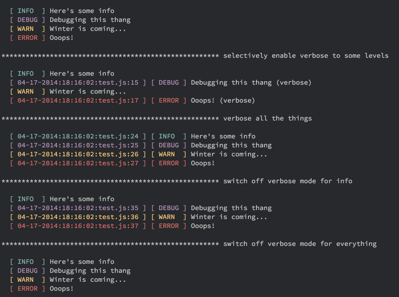

## Luvely
###Simple, beautiful node logging for the little guy

Yet another logging thing. It's logging the way I want/like to use logging. Use it, or not - whatever.

```javascript
var logger = require( '../index' );

// normal logging mode
console.log( '\n' );
logger.info( 'Here\'s some info ' );
logger.debug( 'Debugging this thang ' );
logger.warn( 'Winter is coming...' );
logger.error( 'Ooops!' );


// selectively enable verbose to some levels
logger.verbose( 'error', 'debug' );
logger.info( 'Here\'s some info' );
logger.debug( 'Debugging this thang (verbose)' );
logger.warn( 'Winter is coming...' );
logger.error( 'Ooops! (verbose)' );


// verbose all the things
// did I mention you could chain the calls?
logger
  .verbose()
  .info( 'Here\'s some info ' )
  .debug( 'Debugging this thang ' )
  .warn( 'Winter is coming...' )
  .error( 'Ooops!' );


// switch off verbose mode for info
logger
  .nonVerbose( 'info' )
  .info( 'Here\'s some info ' )
  .debug( 'Debugging this thang ' )
  .warn( 'Winter is coming...' )
  .error( 'Ooops!' );


// switch off verbose mode for everything
logger
  .nonVerbose()
  .info( 'Here\'s some info ' )
  .debug( 'Debugging this thang ' )
  .warn( 'Winter is coming...' )
  .error( 'Ooops!' );

console.log( '\n' );
```



The above code is taken from test/test.js - run it to see luvely in action. More features (and real tests) coming soon
