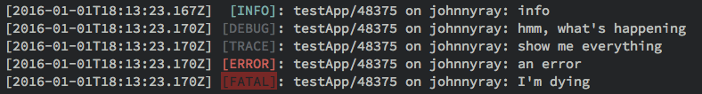

# luvely

A human readable format for bunyan's JSON logging.

### Why?
Bunyan is the best logging solution for node applications. By default, it logs everything in JSON format. It does come with a handy CLI for formatting human readable logs but it's a separate process. Luvely gives you a stream you can use IN ADDITION to your JSON logs. I highly recommend using bunyans JSON formatted logs for machine consumable purposes but machines aren't the ones reading stdout - you are. Use luvely for stdout and JSON everywhere else (files, APIs etc). You get the best of both worlds without having to pipe your process through a script.

### What does it look like?


### Install
```
$ npm install luvely --save
```

### Quick Start
```javascript
const luvely = require('luvely');
const appName = 'myApp';
const luvelyStream = luvely();

const log = bunyan.createLogger({
  name: appName,
  stream: luvelyStream,
  level: 'trace'
});
```

### Recommended Usage
```javascript
const luvely = require('luvely');  
const appName = 'myApp';

const log = bunyan.createLogger({
  streams: [
    {
      level: 'info',
      stream: luvely() // this will go to stdout for humans      
    },
    {
      level: 'info',
      stream: someFileOrThirdPartyStream() // this will be JSON for machines
    }
  ]
});
```

### Tests
```
$ npm test
```
